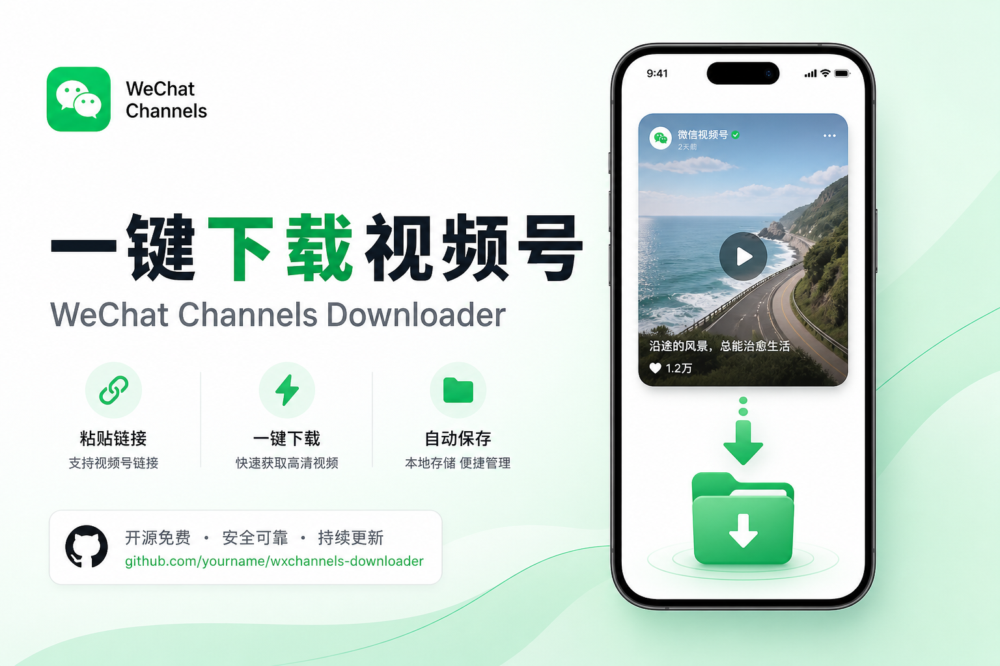
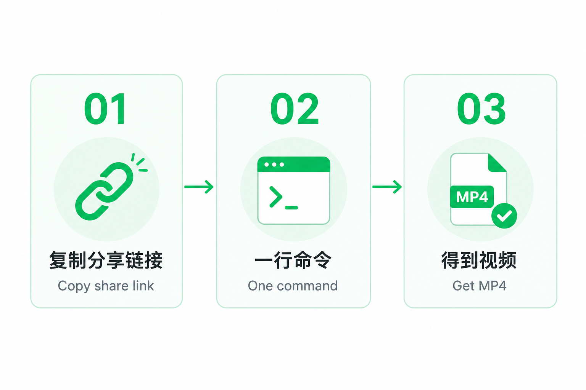

# WeChatチャンネル（動画号）ダウンローダー

<p align="center">
  
</p>

<p align="center">
  <b>共有リンクを貼るだけ。MP4 が手に入る。</b><br/>
  難しい設定なし。初心者でも 30 秒。
</p>

<p align="center">
  <a href="README.md">简体中文</a> ·
  <a href="README_EN.md">English</a> ·
  <a href="#-30秒クイックスタート">日本語</a> ·
  <a href="README_KO.md">한국어</a>
</p>

<p align="center">
  
</p>

<p align="center">
  <a href="https://github.com/lyt26/wechat-channels-download/stargazers"></a>
  
  
</p>

---

## 🟢 初心者向け：Windows アプリ

1. [Releases](https://github.com/lyt26/wechat-channels-download/releases/latest) から  
   **`WeChatChannelsDownloader-Windows.exe`** をダウンロード
2. ダブルクリック → リンクを貼る → 緑のボタン

ソースから起動：

```bash
python gui/app.py
```

---

## なぜ Star する価値があるか

| 困りごと | これまで | これから |
|----------|----------|----------|
| PC に保存したい | 画面録画で画質が落ちる | **コマンド1行で綺麗な MP4** |
| `yt-dlp` は使える？ | **未対応** | `weixin.qq.com/sph/...` 専用 |
| プログラミング必須？ | 証明書・パケット解析 | **リンクをコピーして実行** |

役立ったら **Star** をお願いします。拡散の一番の力になります。⭐

---

## 🚀 30秒クイックスタート

<p align="center">
  
</p>

1. WeChat で動画号を開き、**共有 → リンクをコピー**
2. Python 3.10+ を入れる（初回だけ）
3. 実行：

```bash
git clone https://github.com/lyt26/wechat-channels-download.git
cd wechat-channels-download

python scripts/download_sph.py "https://weixin.qq.com/sph/あなたのID" -o ./downloads
```

`downloads` フォルダの MP4 をダブルクリックすれば再生できます。

---

## ✨ 特徴

- 追加の pip パッケージ不要（標準ライブラリのみ）
- 転送文の中から URL を自動抽出
- Windows / macOS / Linux 対応の安全なファイル名
- `--h265` で高ビットレート優先も可能
- Cursor Agent 用 Skill 同梱

---

## 📦 使い方

```bash
python scripts/download_sph.py "共有リンク" -o ./downloads
python scripts/download_sph.py "見て https://weixin.qq.com/sph/xxxx" -o ./downloads
python scripts/download_sph.py "https://weixin.qq.com/sph/xxxx" -o ./downloads --h265
```

| 引数 | 意味 |
|------|------|
| `url` | 共有リンク、またはリンクを含む文章 |
| `-o` | 保存先フォルダ |
| `--h265` | H.265 を優先 |
| `--json` | 解析 JSON を表示 |

---

## 仕組み（かんたん版）

```text
共有リンク → 本物の動画URLを取得 → 正しくダウンロード → MP4保存
```

公式プレビューは表紙画像だけのことが多く、`yt-dlp` も未対応です。本ツールがその穴を埋めます。

---

## よくある質問

**失敗する / videoUrl がない**  
リンクの期限切れが多いです。WeChat でもう一度コピーしてください。

**商用の大量取得は？**  
個人のバックアップ・許諾済み素材向けです。著作権と規約を守ってください。

---

## ライセンス

MIT。役に立ったらぜひ **Star** を。⭐

<p align="center">
  <a href="https://github.com/lyt26/wechat-channels-download">https://github.com/lyt26/wechat-channels-download</a>
</p>
